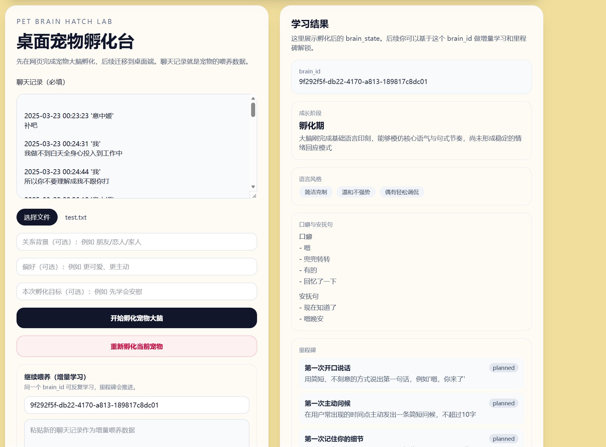
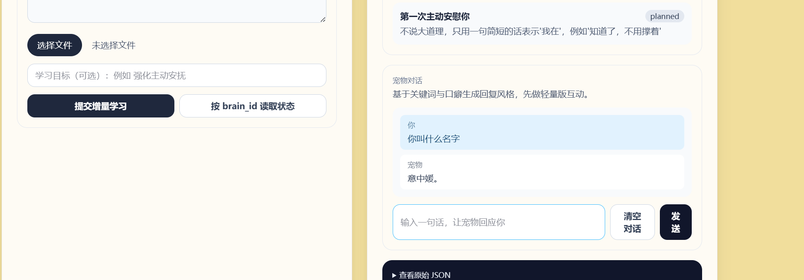

# 用户使用指南

1. 访问地址

	请在浏览器中访问：[https://my-chatai.pages.dev/](https://my-chatai.pages.dev/)

2. 首次上传聊天记录注意事项

	由于服务器长时间未使用会进入休眠状态，**第一次上传聊天记录时可能会失败**。此时请**再次上传一次**，即可正常使用。

3. 聊天对话功能

	聊天记录上传成功后，页面会出现聊天对话框。此时即可与 AI 进行对话。

4. 常见问题

	- 首次上传失败：请重试一次。
	- 若遇到其他问题，请刷新页面或稍后重试。

欢迎体验并反馈问题！

## 示例截图

### 孵化台界面



### 宠物对话界面



> 备注：以下内容主要面向开源开发者，普通用户可忽略。
# My_chatai

一个“可成长桌面宠物”项目，当前先做 Web 孵化台。

## 产品方向

- 最终目标：桌面宠物（Desktop Pet）
- 当前目标：网页设计 + 聊天记录导入 + AI 学习
- 核心理念：聊天记录是宠物的大脑喂养数据，不是一次性分析样本

## 关键能力

- 孵化：首次导入聊天记录，生成宠物初始大脑
- 学习：继续导入聊天记录，增量更新大脑
- 成长：按里程碑演进，支持关键词驱动解锁
- 对话：基于 brain_state 的口癖、语气、关键词进行轻量聊天回复

## 最近新增功能

1. 增量学习计数持久化

- 在 `meta.learn_count` 中记录累计学习次数（统计用途）。

2. 里程碑关键词驱动解锁（不再按学习次数直接解锁）

- M2「第一次主动安慰你」：安抚类关键词累计命中达到阈值解锁。
- M3「第一次记住你的偏好」：偏好类关键词累计命中达到阈值解锁。
- M4「第一次主动发起话题」：主动探问类关键词累计命中达到阈值解锁。
- 关键词累计计数写入 `meta.keyword_counts`，并返回剩余命中数。

3. 聊天栏与后端聊天接口

- 新增后端接口 `POST /api/v1/chat`，根据 `tone/catchphrases/comfort_lines` 与已命中关键词生成回复。
- 前端页面新增聊天区域，支持基于当前 `brain_id` 进行对话。

4. 前端会话本地恢复

- 页面会将关键状态写入 `localStorage`，刷新后可恢复输入和结果。

## 文档入口

- 主提示词：[prompt.md](prompt.md)
- 系统设计：[docs/system-design.md](docs/system-design.md)
- API 契约：[docs/api-contract.md](docs/api-contract.md)
- 路线图：[docs/mvp-roadmap.md](docs/mvp-roadmap.md)

## 技术栈

- 前端：Next.js + TypeScript + Tailwind CSS
- 后端：Python FastAPI
- 性能模块：C++

## 当前开发重点

1. 完善关键词驱动的里程碑策略与阈值
2. 增强聊天接口（从轻量规则版升级为更强对话能力）
3. 打通“会话记忆 + 续聊”能力

## 本地运行

### 1) 启动后端（FastAPI）


```bash
cd backend
python3 -m venv .venv
source .venv/bin/activate
pip install -r requirements.txt
cp .env.example .env
python -m uvicorn app.main:app --reload --host 0.0.0.0 --port 8000 --env-file .env
```

说明：

- 需要在 `backend/.env` 中填写 `OPENAI_API_KEY`
- 健康检查地址：`http://localhost:8000/api/v1/health`

### 2) 启动前端（Next.js）

```bash
cd frontend
npm install
NEXT_PUBLIC_API_BASE=http://localhost:8000 npm run dev
```

### 3) 可选：构建 C++ 特征模块

```bash
cd cpp
cmake -S . -B build
cmake --build build
```
